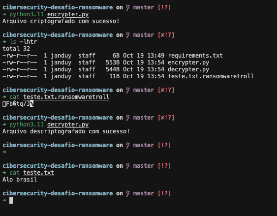

# Projeto de Cibersegurança: Desafio Ransomware

Este projeto faz parte de um curso de Cibersegurança e tem como objetivo explorar e entender o funcionamento básico de um ransomware. **AVISO: Este projeto é estritamente educacional e não deve ser usado para fins maliciosos.**

## Estrutura do Projeto

- `encrypter.py`: Script para criptografar arquivos.
- `decrypter.py`: Script para descriptografar arquivos.
- `teste.txt`: Arquivo de teste para as operações de criptografia e descriptografia.

## Como Funciona

1. **Encriptação**: O script `encrypter.py` criptografa um arquivo específico (neste caso, `teste.txt`) utilizando `pyaes` e remove o arquivo original.
2. **Desencriptação**: O script `decrypter.py` descriptografa o arquivo criptografado e restaura o arquivo original.

## Exemplo de Logs

O projeto inclui um exemplo de logs que podem ser analisados para entender o fluxo de dados e a segurança envolvida:



## Requisitos

Os pacotes necessários estão listados no arquivo `requirements.txt` e podem ser instalados usando:
```sh
pip install -r requirements.txt
```

## Conclusão

Este projeto é uma introdução prática à criptografia usada em ataques de ransomware. Sempre siga práticas éticas ao explorar questões de segurança.
